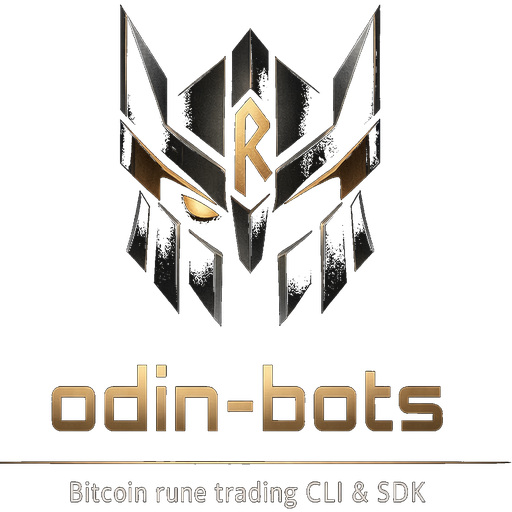

[](https://github.com/onicai/odin_bots/actions/workflows/cicd.yml)

<p align="center">
  
</p>

<p align="center"><em>Powered by onicai Chain Fusion AI on the Internet Computer.</em></p>

---

```
pip install odin-bots
```

Note: On macOS Apple Silicon, install `automake` and `libtool` before running `pip install`:
```
brew install automake libtool
```

# Setup (one time):

    odin-bots init             Configures your project with 3 bots
                               Stored in odin-bots.toml

    odin-bots wallet create    Generate wallet identity
                               Stored in .wallet/identity-private.pem

# How to use your bots:

    Step 1. Fund your odin-bots wallet:
            odin-bots wallet receive
            Send ckBTC or BTC to the address shown.
            BTC deposits require min 10,000 sats and ~6 confirmations.

    Step 2. Check your wallet balance:
            odin-bots wallet balance [--monitor]

    Step 3. Fund your bots (deposits ckBTC into Odin.Fun):
            odin-bots fund <amount> --bot <name>      # in sats
            odin-bots fund <amount> --all-bots

    Step 4. Buy Runes on Odin.Fun:
            odin-bots trade buy <token-id> <amount> --bot <name>
            odin-bots trade buy <token-id> <amount> --all-bots

    Step 5. Check your balances (wallet + bots):
            odin-bots wallet balance --all-bots [--monitor]

    Step 6. Sell Runes on Odin.Fun:
            odin-bots trade sell <token-id> <amount> --bot <name>
            odin-bots trade sell <token-id> <amount> --all-bots
            # to sell all holdings of a token
            odin-bots trade sell <token-id> all --bot <name>
            odin-bots trade sell <token-id> all --all-bots
            # to sell all holdings of all tokens
            odin-bots trade sell all-tokens all --bot <name>
            odin-bots trade sell all-tokens all --all-bots

    Step 7. Withdraw ckBTC from Odin.Fun back to wallet:
            odin-bots withdraw <amount> --bot <name>
            odin-bots withdraw all --all-bots

    Or use sweep to sell all tokens + withdraw in one command:
            odin-bots sweep --bot <name>
            odin-bots sweep --all-bots

    Step 8. Send ckBTC from wallet to an external ckBTC or BTC account:
            odin-bots wallet send <amount> <address>
            (supports both ICRC-1 and BTC addresses)

## Configuration

`odin-bots.toml` (created by `odin-bots init`):

```toml
[settings]
# See README-security.md for details
verify_certificates = false
cache_sessions = true

[bots.bot-1]
description = "Bot 1"

[bots.bot-2]
description = "Bot 2"

[bots.bot-3]
description = "Bot 3"
```

Each bot gets its own trading identity on Odin.Fun. Add or remove `[bots.*]` sections as needed.

## Project Layout

```
my-bots/
├── .gitignore             # ignores .wallet/, .cache/
├── odin-bots.toml         # bot config
├── .wallet/               # identity key (BACK UP!)
│   └── identity-private.pem
└── .cache/                # delegated identities (auto-created)
    ├── session_bot-1.json # no backup needed — regenerated
    ├── session_bot-2.json # when expired (24h lifetime)
    └── session_bot-3.json
```

## Open Source & Verifiable

odin-bots is powered by the onicai ckSigner canister: [`g7qkb-iiaaa-aaaar-qb3za-cai`](https://dashboard.internetcomputer.org/canister/g7qkb-iiaaa-aaaar-qb3za-cai)

The canister code is fully open source with a reproducible build, available at [github.com/onicai/PoAIW](https://github.com/onicai/PoAIW) -> ckSigner branch.

## How It Works

See [README-how-it-works.md](README-how-it-works.md) for technical details.

## Security

See [README-security.md](README-security.md) for security considerations and best practices.

## Contribute

To contribute, see [README-contribute.md](README-contribute.md).

## Status & Disclaimer

This project is in **alpha**. APIs may change without notice.

The software and hosted services are provided "as is", without warranty of any kind. Use at your own risk. The authors and onicai are not liable for any losses — including but not limited to loss of funds, keys, or data — incurred through use of this software or the hosted canister services. No guarantee of availability, correctness, or security is made. You are solely responsible for evaluating the suitability of these services for your use case and for complying with all applicable laws and regulations in your jurisdiction.

## Reference

The Bitcoin rune trading platform is [Odin Fun](https://odin.fun/)

## License

MIT
